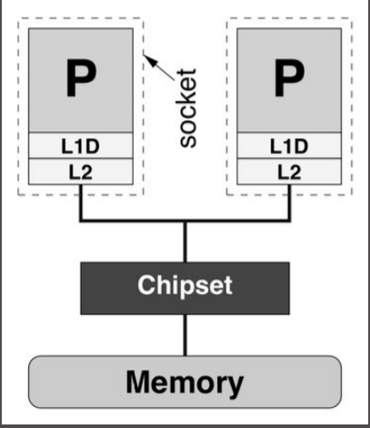
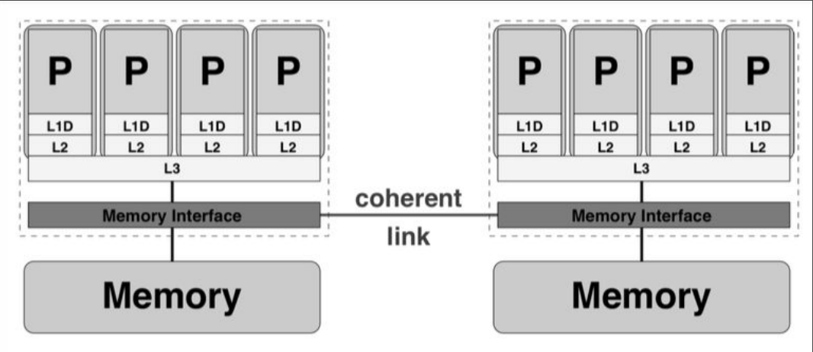

# Clase 02: Título de la Clase

## Contenido: Explicación y Preguntas de Práctica

### Introducción
Se continuará con la segunda parte parte restante de la case anterior

#### Preguntas de Práctica de reaps ode la clase anterior 

- ¿Cuál es el propósito principal de esta clase?

---

### Objetivos
- **Objetivo 1:** Describir el propósito principal.
- **Objetivo 2:** Enumerar metas específicas.

#### Preguntas de Práctica
- ¿Qué objetivos específicos se buscan alcanzar?

---

### Conceptos Clave
- **Concepto 1:** Definición breve.
- **Concepto 2:** Definición breve.

#### Preguntas de Práctica
- ¿Qué significa el **Concepto 1**?
- ¿Cómo se aplica el **Concepto 2**?

---

### Desarrollo del Tema

#### Memoria compartida 

Se trata de revisar al alta eficiencia y la eficacia en cómputo para ver la escalabilidad del algoritmo y responder al negocio y ello es escalable o ya no se debe invertir en ello 

**UMA vs ccNUMA**
Procesos ocupan un mismo espacio físico, y comparten memoria. 

* **UMA:** Uniform Memory
Access, es un modelo
’plano’ de acceso a
memoria (latencia = ancho
de banda)

* **ccNUMA:** 

Cache Coherent Non-uniform Memory Access,
la memoria está físicamente distribuida, pero una red
lógica permite que funcione como memoria en un
mismo espacio f´ısico

*** Investigar subre TPU, GPT 

## Memoria Distribuida

**38**

Cada procesador está conectado a una memoria local, y ningún otro tiene acceso a esta memoria. Los procesadores se comunican a través de una red enviando y recibiendo mensajes de los otros procesadores.

Comentario: 
El P se puedo convertir en un factor dividido entre los procesadores

---

## Sistema Híbrido

**39**

En la práctica, los sistemas no son puramente distribuidos o compartidos, sino una combinación de ambos (híbridos). I.e., nodos de memoria compartida conectados a través de una red, que añaden una complejidad mayor al sistema de comunicación entre procesos. E.g. CPU-GPU clusters

---

## Diseño de un Algoritmo en Paralelo

**40**

Se proponen los siguientes pasos:

* Escoger el paradigma más cercano al problema (compartido, distribuido, híbrido), Método de Foster
* Desarrollar algoritmo de acuerdo al paradigma elegido (pseudocódigo-código)
* Evaluar métricas de performance, que definan el grado de sincronización y comunicación entre procesos. Un mal diseño de comunicación implica mayor costo computacional, mientras que una mala sincronización origina inactividad de procesos. Asimismo, garantizar la precisión del algoritmo.
* Si el código no es eficiente, retornar al primer paso

---

## Resumen:

**41**

* HPC permite escalabilidad y performance en la solución de problemas con grandes cantidades de datos
* Aplicaciones son multidisciplinarias
* Diseño de proyectos HPC considera otras herramientas computacionales (BigData, Cloud, lenguajes de programación)